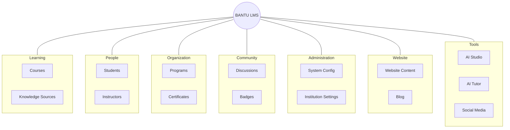

# The Gauntlet Nobody Talks About

Youth unemployment in Zimbabwe is enormous, and it's the product of things far bigger than any one app can touch. I'm not going to sit here and pretend a platform fixes an economy. It doesn't, and Bantucode won't.

And this isn't just a Zimbabwe story. Look at the region and the pattern holds across the border in almost every direction, some countries worse than us, a couple better, but nowhere close to what "full employment" should look like.

::unemployment-chart
::

One honest caveat on that chart, because I'd rather flag it than have you catch it: it uses the World Bank's modeled ILO estimate, which counts anyone who worked even an hour in the past week as employed. I used it because it's the one methodology applied consistently across all eight countries, which matters for a fair comparison, but it badly flatters economies with huge informal sectors. Zimbabwe's own statistics agency, ZIMSTAT, put the real national unemployment rate at roughly 20 to 22% through 2024, more than double the modeled figure on the chart, and an estimated 80% of the jobs that do exist here are informal: unstable, unprotected, and often barely enough to live on. The chart isn't wrong. It's just answering a narrower question than the one that actually matters to the people living it.

But here's the thing that actually gets me out of bed to work on this: tech skills are a genuine way around that wall. Not because there's suddenly a pile of local jobs waiting, but because remote work has quietly redrawn what "the job market" even means. A company hiring a developer increasingly doesn't care what country you're sitting in when you do the work, and the demand for people who can actually build things keeps outrunning the supply almost everywhere. [Korn Ferry projects a global shortfall of more than 85 million skilled workers by 2030](https://www.kornferry.com/insights/this-week-in-leadership/talent-crunch-future-of-work), risking $8.5 trillion in unrealized revenue, and [research from the World Economic Forum and Cognizant](https://www.weforum.org/stories/2025/12/bridging-the-digital-talent-crisis/) finds that demand for digital skills like AI, data, and technology literacy is accelerating far faster than the global supply of people who have them. In sub-Saharan Africa specifically, the World Bank projects demand for 230 million digitally skilled workers, an opportunity that could unlock up to $130 billion in economic value. A capable developer in Harare can get paid for the same output as one in Cape Town. That is real, it happens every day, and the only reason it doesn't happen far more is that job-ready tech skills here are neither affordable nor credible enough for enough people to go compete for that work.

So that's the actual problem I care about. Not one big vague blob, but a chain of specific, separate walls between a smart, motivated person and that opportunity. Let me walk you through the walls first, because you can't build a good answer until you're honest about the question.

## **The Five Walls**

Start at school. In plenty of classrooms the material is years out of date, or the textbook just never showed up. Printing and distributing updated books at scale is expensive and slow, so a teacher ends up improvising from a photocopy, and a class quietly skips whatever didn't make it into the room. That's the first wall: **outdated or missing learning material**. It's not a small inconvenience. It decides what a whole cohort does and doesn't get to learn.

Say a kid clears that anyway and wants to study Computer Science or IT at university. Now they hit the second wall: **there are almost no seats**. These programmes admit a tiny fraction of the people who apply and would genuinely thrive in them. A-level points and a fixed number of chairs decide who gets in, not aptitude, not how badly someone wants it. And part of the reason the seats are so scarce is the third wall, sitting right behind it: **there aren't enough qualified people to teach**. Same shortage shows up in schools, where it looks like one exhausted teacher covering a subject meant for three.

Clear the seat lottery, and there's still money. Even with an offer in hand, **tuition priced against a currency that moves under you month to month** puts a degree out of reach for a lot of families. You can be admitted and still not be able to go.

And suppose someone beats every one of those and actually learns the skill, on their own, off YouTube and grit. There's one last wall, and it's the quietest and meanest: **nobody trusts the credential**. You can be genuinely good and still be invisible to an employer, especially a remote one who will never meet you, never sit across a table from you, and has no way to check a self-reported skill or an easily-forged certificate.

Five walls. Not one problem, five, and each one stops a different person at a different point. That's the map. Here's what I've actually built against it.

## **So I Started Knocking Them Down**

For the missing-textbook wall, there's AI Studio. You hand the platform a syllabus, or even just a topic, along with some context about who the learners are, and it generates the whole course: chapters, lessons, quizzes, practical and coding exercises, assignments. A school that never got the book can still get a full, structured course to teach from. That's the point of it. Not a gimmick, a way to turn "here's our syllabus" into something a class can actually learn from tomorrow.

None of that ships straight to a student unchecked, though. Every piece of AI-generated content lands in a review queue first, and the wizard itself has a dedicated review step before anything gets created, so a human looks at what the AI produced before it becomes a live lesson. There are automated guardrails underneath that too, malformed output gets caught and either fixed or dropped before it ever reaches the review stage. The AI drafts fast. It doesn't get to publish itself.

And AI Studio is an accelerator, not the only way in. Every lesson can be built or edited by hand too, through a proper WYSIWYG editor built into the platform, the kind with a real toolbar for headings, lists, code blocks, links, all of it. An instructor can start from an AI-generated draft and rework it, or skip AI Studio entirely and write a lesson from scratch. Either way, the same editor and the same content-block system is underneath it.

<figure>
  
  <figcaption>AI Studio: give it a syllabus and some context about the learners, get a full course back.</figcaption>
</figure>

The seat lottery is a different kind of problem, so it needs a different kind of answer. Bantucode doesn't ask anyone to win an admissions process, because it sits entirely outside the university gate. But sitting outside the gate is worthless if the on-ramp is soft, so it isn't. Progress is tracked by mastery of each skill, not by whether you finished a video, and the assignments are built to test whether you can actually do the thing rather than recognise it on a multiple-choice quiz. One course's capstone has a learner orchestrate a whole team of AI agents (a product manager, an architect, a backend and frontend engineer, a QA agent) to build a real application end to end. That's not a quiz you can guess your way through. It's an open door, but it's an honest one.

<figure>
  
  <figcaption>A real capstone brief. This is the kind of assignment that's hard to fake your way through.</figcaption>
</figure>

That same rigour needs to scale past the number of humans available to teach, which is the instructor wall. So every lesson has an AI tutor sitting inside it, grounded in that specific course's material rather than generic chatbot trivia. It answers from what the course actually teaches, so it doesn't wander off and contradict the lesson, and it means one platform can support far more learners than the small pool of qualified instructors ever could in person.

<figure>
  
  <figcaption>The tutor lives right inside the lesson, grounded in what that lesson actually teaches, and it cites where the answer came from.</figcaption>
</figure>

Then there's paying for it, which is where a lot of well-meaning platforms quietly assume a Visa card tied to a bank account most people here don't have. Bantucode is wired for local payment rails from day one. Paynow and EcoCash work, so people pay with mobile money the way they actually move money here. No pretending everyone banks like Silicon Valley.

And the trust wall, the one that makes real skill invisible, is answered by certificates that an employer can verify independently. They aren't a PDF nobody double-checks. Someone on the other end can confirm a certificate is real without taking the learner's word for it, and for remote work specifically, where the whole relationship has to be built without ever shaking a hand, that verification is often the difference between getting considered and getting ignored.

It goes further than a yes or no on a certificate, too. The platform already generates an AI performance summary for each student, real strengths and real areas to improve, pulled from their actual grades and engagement rather than a generic pep talk, and today that lives with the student and the institution as a downloadable report you can share. The direction I want to take it in is opening a version of that up to employers directly, so a hiring manager isn't only confirming a piece of paper is genuine, they're seeing how someone actually performed.

## **The Software Underneath**

Every one of those fixes reaches further when it isn't just sitting on a website waiting for one learner at a time to stumble onto it, and this is the part worth being precise about. Bantucode is my school: an independent online school, teaching tech skills specifically. The software running underneath it is a separate thing called Bantu LMS, and it isn't locked to tech at all. Any school, college, or university can run Bantu LMS as their own learning platform under a support agreement, for whatever subject they actually teach, instead of trying to build and maintain that infrastructure themselves. An institution gets AI Studio itself, not content I hand them. They connect the AI model they already trust and pay for (Claude and Gemini both work today, more on the way) and build their own courses with it, or skip the AI entirely and write lessons by hand through the same editor, whichever direction actually fits how they work. Alongside that: the tutor, a working LMS with progress and assignments, and someone keeping the whole thing running. That's how the fixes above reach a room full of students through the institution already trying to serve them, not one signup at a time. It's also, honestly, how this becomes something that can sustain itself instead of a charity that runs out of evenings.

We manage the platform for them day to day, but nobody gets a one-size-fits-all hosting arrangement handed to them. It starts with an actual assessment: how the institution runs today, headcount, existing systems, what they're trying to achieve, and from that we recommend the setup that genuinely fits rather than whatever's easiest for us to sell. And nobody signs anything sight unseen. Every institution gets a test environment first, their own courses, their own people, before they commit to onboarding for real.

Here's the whole thing laid out the way the product itself organises it, straight off the actual sidebar, because "a learning platform" undersells how much is actually under the hood:

<figure>
  
  <figcaption>What an institution actually gets: real course management, not a slide in a pitch deck.</figcaption>
</figure>

## **This Can't Be a One-Person Mission**

I've built the core of this alone so far. Nights and weekends, stacked against client work, one developer shipping in the quiet. And I'm clear-eyed that it cannot stay that way, because a thing meant to reach schools, companies, and community organisations does not scale on one person's spare hours.

I don't want this locked to one kind of partner either. Organisations, schools, churches, communities, individuals, companies, anyone who actually aligns with the dream is fair game, not a fixed list I'm working down. One example of what that looks like in practice: partnering with a drug rehabilitation centre to teach young people in recovery real tech skills, not occupational therapy that ends at a certificate, but a genuine shot at future work on the other side. Another: working directly with companies to deliver paid AI and tech training to their teams, which solves a real business need and helps fund the broader mission at the same time. Neither of those happens from one laptop at 2am. They happen when the right people and the right organisations decide this is worth building together.

## **How This Actually Gets Built**

I'm building this around client work that pays my actual bills, which means progress happens in whatever hours are left after a full day of someone else's priorities. What makes that workable at all is a full suite of AI agents doing real engineering work alongside me, not a novelty, actual leverage, and regular conversations with people across the ed-tech and AI space who are willing to tell me where an idea is weak instead of just being polite about it. It's not one person shipping in total isolation. It's one person, serious AI tooling, and a widening circle of people who know parts of this space better than I do.

The problem is real, the people hitting these walls are real, and that's what keeps me showing up for it after a full day of client work instead of just closing the laptop.

Expect more posts as it moves: architecture breakdowns, the parts that broke in spectacular fashion, the first real partnerships, and eventually the actual launch. That's the deal I made when I started writing here. Tech tips, project breakdowns, and the honest version of the story. This is me keeping it.

Until then, keep coding, stay caffeinated, and if you're building something alone in the quiet right now, I see you. Keep going.
