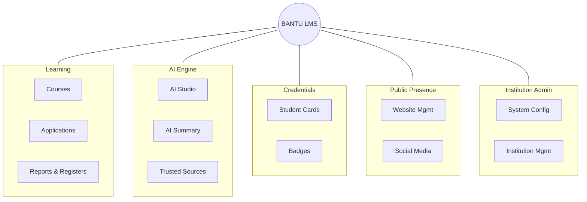

# Building Bantucode

Youth unemployment in Zimbabwe is enormous, and it's the product of things far bigger than any one app can touch. I'm not going to sit here and pretend a platform fixes an economy. It doesn't, and Bantucode won't.

But here's the thing that actually gets me out of bed to work on this: tech skills are a genuine way around that wall. Not because there's suddenly a pile of local jobs waiting, but because remote work has quietly redrawn what "the job market" even means. A company hiring a developer increasingly doesn't care what country you're sitting in when you do the work, and the demand for people who can actually build things keeps outrunning the supply almost everywhere. A capable developer in Harare can get paid for the same output as one in Cape Town. That is real, it happens every day, and the only reason it doesn't happen far more is that job-ready tech skills here are neither affordable nor credible enough for enough people to go compete for that work.

So that's the actual problem I care about. Not one big vague blob, but a chain of specific, separate walls between a smart, motivated person and that opportunity. Let me walk you through the walls first, because you can't build a good answer until you're honest about the question.

## **The Gauntlet Nobody Talks About**

Start at school. In plenty of classrooms the material is years out of date, or the textbook just never showed up. Printing and distributing updated books at scale is expensive and slow, so a teacher ends up improvising from a photocopy, and a class quietly skips whatever didn't make it into the room. That's the first wall: **outdated or missing learning material**. It's not a small inconvenience. It decides what a whole cohort does and doesn't get to learn.

Say a kid clears that anyway and wants to study Computer Science or IT at university. Now they hit the second wall: **there are almost no seats**. These programmes admit a tiny fraction of the people who apply and would genuinely thrive in them. A-level points and a fixed number of chairs decide who gets in, not aptitude, not how badly someone wants it. And part of the reason the seats are so scarce is the third wall, sitting right behind it: **there aren't enough qualified people to teach**. Same shortage shows up in schools, where it looks like one exhausted teacher covering a subject meant for three.

Clear the seat lottery, and there's still money. Even with an offer in hand, **tuition priced against a currency that moves under you month to month** puts a degree out of reach for a lot of families. You can be admitted and still not be able to go.

And suppose someone beats every one of those and actually learns the skill, on their own, off YouTube and grit. There's one last wall, and it's the quietest and meanest: **nobody trusts the credential**. You can be genuinely good and still be invisible to an employer, especially a remote one who will never meet you, never sit across a table from you, and has no way to check a self-reported skill or an easily-forged certificate.

Five walls. Not one problem, five, and each one stops a different person at a different point. That's the map. Here's what I've actually built against it.

## **So I Started Knocking Them Down**

For the missing-textbook wall, there's AI Studio. You hand the platform a syllabus, or even just a topic, along with some context about who the learners are, and it generates the whole course: chapters, lessons, quizzes, practical and coding exercises, assignments. A school that never got the book can still get a full, structured course to teach from. That's the point of it. Not a gimmick, a way to turn "here's our syllabus" into something a class can actually learn from tomorrow.

<figure>
  
  <figcaption>AI Studio: give it a syllabus and some context about the learners, get a full course back.</figcaption>
</figure>

The seat lottery is a different kind of problem, so it needs a different kind of answer. Bantucode doesn't ask anyone to win an admissions process, because it sits entirely outside the university gate. But sitting outside the gate is worthless if the on-ramp is soft, so it isn't. Progress is tracked by mastery of each skill, not by whether you finished a video, and the assignments are built to test whether you can actually do the thing rather than recognise it on a multiple-choice quiz. One course's capstone has a learner orchestrate a whole team of AI agents (a product manager, an architect, a backend and frontend engineer, a QA agent) to build a real application end to end. That's not a quiz you can guess your way through. It's an open door, but it's an honest one.

<figure>
  
  <figcaption>A real capstone brief. This is the kind of assignment that's hard to fake your way through.</figcaption>
</figure>

That same rigour needs to scale past the number of humans available to teach, which is the instructor wall. So every lesson has an AI tutor sitting inside it, grounded in that specific course's material rather than generic chatbot trivia. It answers from what the course actually teaches, so it doesn't wander off and contradict the lesson, and it means one platform can support far more learners than the small pool of qualified instructors ever could in person.

<figure>
  
  <figcaption>The tutor lives right inside the lesson, grounded in what that lesson actually teaches.</figcaption>
</figure>

Then there's paying for it, which is where a lot of well-meaning platforms quietly assume a Visa card tied to a bank account most people here don't have. Bantucode is wired for local payment rails from day one. Paynow and EcoCash work, so people pay with mobile money the way they actually move money here. No pretending everyone banks like Silicon Valley.

And the trust wall, the one that makes real skill invisible, is answered by certificates that an employer can verify independently. They aren't a PDF nobody double-checks. Someone on the other end can confirm a certificate is real without taking the learner's word for it, and for remote work specifically, where the whole relationship has to be built without ever shaking a hand, that verification is often the difference between getting considered and getting ignored.

It goes further than a yes or no on a certificate, too. The platform already generates an AI performance summary for each student, real strengths and real areas to improve, pulled from their actual grades and engagement rather than a generic pep talk, and today that lives with the student and the institution as a downloadable report you can share. The direction I want to take it in is opening a version of that up to employers directly, so a hiring manager isn't only confirming a piece of paper is genuine, they're seeing how someone actually performed.

## **One Platform, Whole Institutions At Once**

Every one of those fixes reaches further when it isn't just sitting on a website waiting for one learner at a time to stumble onto it. So Bantucode is built so that schools, colleges, and universities can run it as their own learning platform under a support agreement, instead of trying to build and maintain ed-tech infrastructure they were never going to be able to afford. An institution gets AI-generated course content for its own syllabus, the tutor, a working LMS with progress and assignments, and someone keeping the whole thing running. That's how the fixes above reach a room full of students through the institution already trying to serve them, not one signup at a time. It's also, honestly, how this becomes something that can sustain itself instead of a charity that runs out of evenings.

Here's the whole thing laid out, because "a learning platform" undersells how much is actually under the hood:

<figure>
  
  <figcaption>What an institution actually gets: real course management, not a slide in a pitch deck.</figcaption>
</figure>

## **This Can't Be a One-Person Mission**

I've built the core of this alone so far. Nights and weekends, stacked against client work, one developer shipping in the quiet. And I'm clear-eyed that it cannot stay that way, because a thing meant to reach schools, companies, and community organisations does not scale on one person's spare hours.

A couple of directions I genuinely want to chase: working with drug rehabilitation centres to give people in recovery practical IT skills as a real path back into employment, not occupational therapy that ends at a certificate, but an actual shot at work on the other side. And working directly with companies to deliver paid AI and tech training to their teams, which solves a real business need and helps fund the broader mission at the same time. Neither of those happens from one laptop at 2am. They happen when the right people and the right organisations decide this is worth building together.

## **The Honest Part**

This is not finished, and it is not launched. I'm laying the foundation mostly solo right now, and some days that means cracking a genuinely hard problem and feeling like a wizard. Other days it means staring at a login flow for four hours because auth remains undefeated. Building alone means the only thing to bounce the "wait, is this even the right approach" doubt off of is a rubber duck and, increasingly, Claude. I'm not going to dress that up with fake numbers or a launch date I can't promise. What I can tell you is that this isn't a side project I'll get bored of. The problems are real, the people hitting those walls are real, and I intend to keep chipping.

Expect more posts as it moves: architecture breakdowns, the parts that broke in spectacular fashion, the first real partnerships, and eventually the actual launch. That's the deal I made when I started writing here. Tech tips, project breakdowns, and the honest version of the story. This is me keeping it.

Until then, keep coding, stay caffeinated, and if you're building something alone in the quiet right now, I see you. Keep going.
